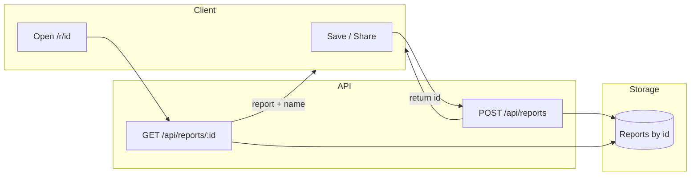
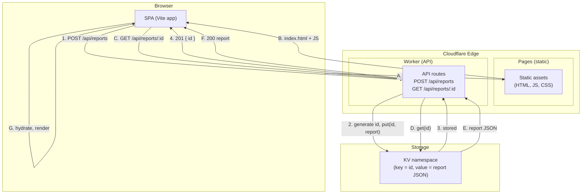
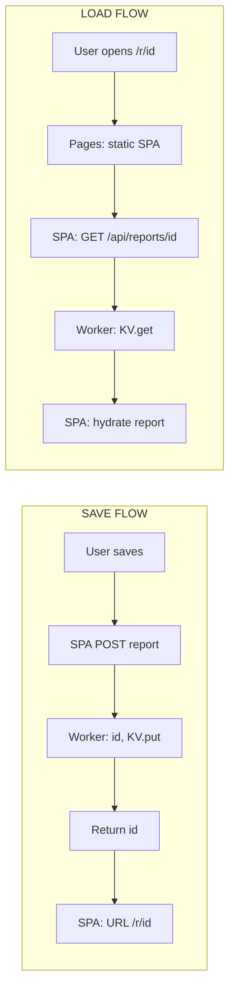

# Shareable report URL system (name/hash, hosted)

**Plan:** Hosted, shareable report URLs for the solar ROI calculator — reports identified by an opaque id (and optional name/slug), with schema evolution, link longevity, Cloudflare (Pages + Workers + KV), and local dev that mirrors production.

---

## Does "all info including the name in the hash" make sense?

**Short answer:** It can, but in two different ways—and only one is practical for your report size.

- **Literal "all info in the hash":** Put the full report (and name) in the URL fragment. **Problem:** `SavedReport` is large (config, financing, trading, tariff, `exampleMonths`, `curvedMonthlyKwh`, optional `result`). Even compressed, you hit ~2k URL limits; many reports would exceed that. So "all data in the hash" is only viable for **tiny** payloads (e.g. a few params) or "share config only, recalc on open."
- **Practical "everything you need in the URL":** The URL is the only thing needed to open the report: a **stable id** (and optionally the **name** for display). The actual report data lives on your server (or, in a minimal variant, in the fragment but then size-limited). So: **name + id in the URL**, data resolved by id from your backend (or from fragment if you choose the compact variant).

**Recommendation:** Hosted by-id with **name from server** (or optional slug in path). Use the hash only for optional in-page state (e.g. `#section=finance`), not for the full payload.

---

## Recommended URL shape and data flow

- **Canonical link:** `https://your-host.com/r/{id}`
  - `id` = opaque, unguessable (e.g. UUID v4 or nanoid ~21 chars). **Not** a content hash (same report would always get same id; you want one id per "saved" report).
- **Optional vanity:** `https://your-host.com/r/{slug}-{id}`
  - `slug` = URL-safe name for readability; server resolves **only by `id`**. Name in path is display-only; never use it for auth or lookup.
- **Name:** Stored in the report payload; returned by `GET /api/reports/:id`. So "the name is in the URL" only if you add it as a slug; the source of truth is the stored report.



---

## Negatives and mitigations (from deep dives)

| Negative | Mitigation |
|----------|------------|
| **Guessable / enumerable ids** | Use 128+ bit random id (UUID v4 or crypto random). Never sequential or short codes. |
| **Sensitive name in URL** | Don't put PII in path/slug. Resolve name from stored report; slug is optional, non-sensitive label only. |
| **Referrer / history / logs leak URL** | Set `Referrer-Policy: no-referrer` or `strict-origin-when-cross-origin`. Treat path as "may be logged"; no secrets in URL. |
| **Hash-only key** | If id is only in fragment, server can't validate or log. Prefer **path** for id: `/r/:id`. |
| **Full payload in fragment** | ~2k limit; large reports won't fit. Use server storage keyed by id; keep fragment for optional UX state only. |
| **Old links break when schema changes** | Add **schemaVersion** to payload; support read-time migration for N and N-1; never rely on "missing field = old." |
| **Deleting report breaks shared links** | Prefer **soft delete** (`deletedAt`); when loading by id, still return report but show "This report has been deleted" instead of 404. |
| **Same name, different content over time** | Keep one **stable id** per report (current overwrite-by-name). Optionally add **revisions** (e.g. `revisionId` or version history) so links can point to "latest" or "this revision." |
| **Abuse (flood of creates, scraping)** | Rate limit POST/GET by IP (and by user if auth); max body size; unguessable ids make enumeration impractical. |
| **Copy-paste drops fragment** | Provide explicit "Copy link" that uses `navigator.clipboard.writeText(fullUrl)` and confirm "Link copied." Prefer path-based id so link works even if fragment is stripped. |

---

## Maintaining links and reports as you add features

- **Schema evolution**
  - Add **schemaVersion** (integer) to every `SavedReport` (e.g. in payload and in API responses).
  - On **read**: detect version, run a **migrateReport(raw) → SavedReport** (current shape). Support at least current and previous version; no automatic rewrite of stored blobs.
  - On **write**: always save with latest schemaVersion.
- **New fields / features**
  - Add optional fields with defaults in the migrator so old payloads still parse.
  - Breaking renames: handle in migrator (old key → new key) so old links keep working.
- **Deprecation**
  - After supporting N-1 versions, document "we support opening links from the last N major versions." When dropping very old versions, show a clear "Report format too old to open" and optionally offer export.
- **Revisions (optional)**
  - To support "same report, different content over time" with stable links: keep one **id** per report, add **revisionId** (or stored snapshots) per save. Link: `/r/:id` (latest) or `/r/:id/v/:revisionId` (specific snapshot). Current overwrite-by-name in `savedReportsDb.ts` stays; revisions are an extension if you need history.

---

## Architecture: what you need to host

- **Frontend (existing SPA):** Add routing so that `/r/:id` loads the app, reads `id`, fetches report, then calls the same `handleLoadReport` flow you already use for IndexedDB loads.
- **Backend (new):** Two endpoints:
  - **POST /api/reports** — body: `{ name?, report: SavedReport }` (or minimal fields you accept). Generate id, store, return `{ id }`.
  - **GET /api/reports/:id** — return report (and name) or 404. If you add soft delete, return report with `deletedAt` and let the app show "Deleted" state.
- **Storage:** DB or object store keyed by id. Plan assumes **Cloudflare**: static SPA on Pages + Workers API + KV (or R2). Same idea works with Vercel/Netlify + their KV/blob.

So: **static hosting for the SPA + a small serverless API + blob/DB by id**. Name and report content live in storage; URL carries only id (and optional slug).

---

## Optional: self-contained "share via hash only" (no server)

If you want a **no-backend** option for small shares:

- Encode **version + name + minimal payload** in the fragment (e.g. `#v2:Base64(name):Base64(compressed config)`). Omit heavy fields (e.g. full `result`, long arrays) or recalc on open.
- Enforce ~1.5–2k character cap; document that complex reports may not be shareable this way.
- Treat **name as display-only** (not part of integrity check) so editing the visible name in the URL doesn't break the link; verify only version + payload (or a content hash of payload).
- This coexists with hosted links: e.g. "Copy link" could try compact encoding first and fall back to "Save to cloud and get link" if over size.

---

## Implementation touchpoints

- **Routing:** Add React Router (or similar) with routes: `/` (wizard/landing), `/r/:id` (view report by id). On `/r/:id`, read `id`, call `GET /api/reports/:id`, then `handleLoadReport(report)`.
- **Share / Save to cloud:** From ResultsSection or SaveReportModal, add "Share link" that POSTs current report (and name), gets `id`, then copies `origin + /r/ + id` to clipboard.
- **Types:** Add `schemaVersion` to `SavedReport`; add a small `migrateReport` (or versioned readers) in a util used by both IndexedDB load and API load.
- **API:** New serverless module (Cloudflare Worker or Pages Functions): POST (create, return id), GET by id; optional soft delete and `deletedAt` in response.
- **DB layer:** Keep `savedReportsDb` for local saves; add a thin client for "cloud" (e.g. `getReportById(id)`, `createReport(report)`) that calls your API.

---

## Diagrams: what runs where (Cloudflare)

**Full picture — save and load:**



**Short version — two flows:**



**Moving parts (what you need to understand):**

| # | Part | What it does |
|---|------|--------------|
| 1 | **SPA route `/r/:id`** | Reads `id` from the URL and fetches the report, then shows it. |
| 2 | **SPA "Share" / "Save to cloud"** | Sends report to API, gets back `id`, shows/copies `https://site.com/r/{id}`. |
| 3 | **Worker script** | Handles `POST /api/reports` (store, return id) and `GET /api/reports/:id` (return report). |
| 4 | **KV namespace** | Storage: one key per report (`id` → report JSON). |
| 5 | **wrangler.toml** | Config: Worker name, KV binding, env (dev vs production). |
| 6 | **Pages / static build** | The built SPA (`dist/`) deployed so `/r/*` serves the app. |

---

## Local development that mirrors Cloudflare (easy and maintainable)

**Goal:** One or two commands. No Cloudflare account needed for basic dev. Same code path as production.

### Option A — One command (recommended)

Use **@cloudflare/vite-plugin** so the Worker runs inside the Vite dev server. One process, one port.

- **Install:** `wrangler`, `@cloudflare/vite-plugin`
- **Config:** Add Worker entry (e.g. `worker.ts` or `functions/api/[[path]].ts`), add KV binding in `wrangler.toml`, wire plugin in `vite.config.ts`
- **Run:** `npm run dev` — SPA + API + local KV (simulated by Wrangler) on one port. No login.

### Option B — Two commands

- Terminal 1: `wrangler dev` (e.g. port 8787).
- Terminal 2: `npm run dev` (Vite on 5173) with proxy: `/api` → `http://localhost:8787`.
- Or one script: `concurrently "wrangler dev" "vite"` and proxy in Vite.

### Option C — No Cloudflare tooling (fallback)

Small Express (or similar) server: POST/GET `/api/reports` with in-memory or file store. Vite proxies `/api` to it. Easiest for someone who doesn't want to install Wrangler; **does not** mirror KV/Workers behavior.

**Recommendation:** Option A for parity and one codebase; Option C only if you need "no Wrangler" for some devs.

### Single source of truth for API

- **Shared module** (e.g. `src/api/reports-api.ts`): path constants (`POST /api/reports`, `GET /api/reports/:id`) and TypeScript types for request/response.
- Worker and (if you add it) Express mock **both import** this module. New routes or fields go there first.

### Minimal file layout

```
solar-roi-calculator/   (or repo root)
├── wrangler.toml           # Worker + KV binding; [env.dev] & [env.production]
├── .dev.vars              # Local secrets (gitignore); copy from .dev.vars.example
├── .dev.vars.example      # Keys only, placeholders
├── package.json           # "dev": vite (with plugin) or proxy + wrangler
├── functions/             # Pages Functions = API (if using /functions)
│   └── api/
│       └── [[path]].ts    # or reports.ts → /api/reports
├── src/
│   ├── api/
│   │   └── reports-api.ts # Paths + types (shared)
│   └── ...
└── dist/                  # Build output; wrangler pages dev serves this
```

### Local vs production (one table)

| What | Local | Production |
|------|--------|------------|
| SPA | Vite dev or `wrangler pages dev dist` | Pages serves built `dist/` |
| API | Same Worker/Functions code, local KV | Same code, production KV |
| KV | Simulated by Wrangler (or dev namespace) | Real KV namespace |
| Env / secrets | `.dev.vars`, `[env.dev]` | Dashboard / `wrangler secret put`, `[env.production]` |
| Origin | `http://localhost:5173` or 8788 | `https://your-project.pages.dev` |

### Maintenance checklist

- **New API route:** Add handler under `functions/api/` (or Worker), use shared types; add binding in `wrangler.toml` for both `[env.dev]` and `[env.production]` if needed.
- **New storage (KV/R2/D1):** Add binding in `wrangler.toml` for dev and production; create namespace in dashboard for both.
- **Secrets:** Document in README: "Add X to Cloudflare (dashboard or `wrangler secret put`) and to `.dev.vars` for local." Use `.dev.vars.example` with key names only.

---

## Explain it simply (like to a small child)

**What happens when you click "Save" or "Share"?**  
You get a link. The app sends your report to a small program that lives on the internet. That program puts the report in a special cupboard and gives you a link. If you send the link to someone, they can open the same report. So: "Send my report to the cloud and get a link."

**What is "the cloud" or "the server"?**  
It's a small program that does only two things: (1) remember a report when you give it one, and (2) give that report back when someone visits the link.

**What is KV / the store?**  
It's like a filing cabinet. Each report has one drawer with a secret code (the id). When you save, the program puts your report in the drawer for that id. When someone opens the link, the program looks up the id and sends back the report. You don't need to know how the cabinet is built—just that every report is stored under its own id.

**Why is there a weird id in the link?**  
So only people with the link can see that report. The id is like a secret key. No link, no id, no way to ask for that report. We don't show a list of reports anywhere; the only way in is with the link. That keeps it simple and private.

**What does "local dev" mean?**  
Running a copy of that same small program and filing cabinet on your own computer. You can change the code, save reports, and open links on your machine. Nothing you do there affects real users or real data. When it all works locally, you then put the same program on the real cloud.

---

## Gotchas and parity checklist

**Gotchas:**

- **KV is eventually consistent** — After a write, a read in a *different* request might not see it yet. Don't rely on read-after-write in the same flow for correctness. Local (Miniflare) can look "more consistent" than production; design for eventual consistency.
- **CORS** — Local origin is `http://localhost:5173` (or 8787); production is your real domain. Use one config (e.g. `ALLOWED_ORIGINS` from env) so the same code works both places.
- **Secrets** — Production: Cloudflare dashboard or `wrangler secret put`. Local: `.dev.vars`. Keep a single checklist in the README so both stay in sync.
- **Body consumed once** — In the Worker, `request.json()` consumes the body. Use `request.clone()` if you need to read it twice.
- **Wrangler version** — Pin `wrangler` in package.json (e.g. `3.x`) so everyone (and CI) uses the same version; KV behavior can differ across versions.

**Before deploy — parity checklist:**

- [ ] Write then read in **two separate** requests (e.g. two fetches); app doesn't assume the read sees the write immediately.
- [ ] CORS: browser from `localhost` to local Worker succeeds (preflight + actual).
- [ ] Every secret in the docs exists in `.dev.vars` (local) and in Cloudflare (production).
- [ ] Worker fails fast if a required secret is missing.
- [ ] No reliance on module-level mutable state across requests (stateless).
- [ ] Same Wrangler version in package.json and CI.

---

## Cloudflare cost (reference)

- **Free tier:** 100k Workers requests/day, 1k KV writes/day, 100k KV reads/day, 1 GB KV storage. R2: 10 GB, 1M Class A, 10M Class B/month.
- **~1000 reports/month:** Stays free (well under limits).
- **Paid:** Roughly when you exceed ~1k new reports/day (KV writes) or ~20k reports stored (1 GB KV); Workers Paid is $5/month and includes higher limits.

---

## Summary

- **Yes, it makes sense:** Shareable URL = path with **opaque id**; **name** in stored payload (and optionally as slug in path). "All info in the hash" in the sense of "everything needed to open" = id in URL + optional name; full data from server (or, in a limited way, from fragment if payload is small).
- **Hosting:** Static SPA + serverless API + storage by id (Cloudflare Pages + Workers + KV); no need to put full report in the URL.
- **Negatives:** Addressed by unguessable ids, no secrets in URL, schemaVersion + read-time migration, soft delete, optional revisions, rate limiting, and explicit "Copy link" UX.
- **Maintaining links:** schemaVersion in payload, migrate on read, support N-1 versions, soft delete so links don't 404, stable id across renames; optionally add revisions for "view this version" links.
- **Local dev:** One command with @cloudflare/vite-plugin (SPA + Worker + local KV); or two commands (wrangler dev + Vite proxy). Shared API types and one wrangler.toml with env.dev / env.production keep it maintainable.
